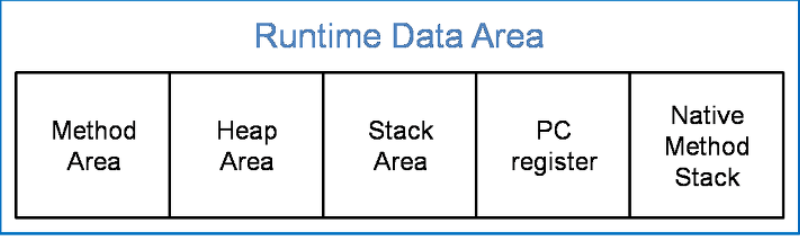

BlackJack CodeReview
==

1. If문을 쓰되 else를 없애자.

2. main함수는 최대한 간소화하자. (spring controller를 보면 최소한의 메서드만 쓴 걸 볼 수 있다...)

3. 객체의 책임을 분명히하자.

4. 클래스네이밍을 신경쓰자. 

메서드나 필드의 이름은 항상 신경써야한다. 직관적으로 읽혀야하며 해당 네이밍이 정확히 어떤일을 하는지 표현해야한다.

5. 캡슐화를 적용하자. Getter Setter를 이용해 접근하고 수정하자.

캡슐화를 왜 사용해야할까? 

private(protected)로 선언하게되면 다른 클래스의 접근을 허락하지않고 해당 클래스의 멤버를 외부에서 쉽게 바꿀 수가 없다.

이를 정보를 은닉한다고 말하며, 정보의 은닉으로 향후 유지보수나 확장시에 오류를 줄일 수 있다.

6. List타입과 ArrayList타입의 차이점
```java
 List<Card> cardDeck = new ArrayList<>();
 ArrayList<Card> cardDeck = new ArrayList<>();
```

답은 **다형성**이다. 
List는 인터페이스 ArrayList는 클래스다.

List<> = new ArrayList로 선언하게되면 나중에 ArrayList가 아닌 List인터페이스를 구현한 다른 클래스를 선언해줄 수 있기때문에 보다 **유연한**프로그래밍이 가능해진다.


7. git flow를 공부하자. (master, develop, feature)

    #Git폴더에 따로 정리

8. 라이브러리와 프레임워크의 차이점

익숙한 단어들이다. 내가 이제 막 학습을 시작한 Spring은 프레임워크이고, C언어를 공부하며 무심코 사용했던 <stdio.h>에 있는 printf, fopen, puts 등은 C에서 제공하는 기본 라이브러리다.

이들의 차이점은 프로그래밍 제어 흐름에 있다.

C 헤더파일에서 불러와 사용하던 함수들에대한 제어권은 나에게있다. 모든 흐름은 작성자가 설계하지만, Spring 프레임워크에서 제어 흐름은 프레임워크에있다.

그래서 이를 제어의 역전(IoC)이라 한다.

말 그대로 프로그래밍 제어의 책임이 개발자에게서 프레임워크로 넘어가게되고, 그만큼 개발자는 핵심 비지니스로직에 몰두할 수 있게된다.

IoC와 함께 나오는 개념중 DI(의존관계주입)이 있는데, 함께 이해하면 프레임워크에대한 이해가 쉬워질것 같다.

@Controller 나 @Service 애너테이션을 붙여주면 스프링이 올라올때 컴포넌트 스캔을 통해 스프링은 빈으로 객체를 등록하게되고, @Autowired를 이용해 생성자에 인스턴스를 스프링에게 주입받을 수 있다. 이를 DI라 한다.

보통은 객체를 개발자가 직접 생성하고 참조변수에 연결시켜주는 작업이 있어야지만 해당 인스턴스를 사용할 수 있지만, 애너테이션을 붙여줌으로 스프링에게 객체생명주기에대한 권한을 넘겨주게된다.

이처럼 제어의 역전은 제어의 흐름이 개발자에게서 외부환경으로 넘어가는것을 뜻한다.

---

1. Scanner vs BufferedReader

    보통 buffer는 StringBuffer 에서 들어보았지만 BufferedReader에대해선 처음 들어보았다. Scanner와 유사한 기능을 가진 BufferedReader에 대해 알아보자.

    C언어에서 scanf를 사용할 때 버퍼의 기능에대해 알아본적이 있다. 버퍼란 키보드의 입력을 버퍼라는 임시저장소에 모아놓았다가 버퍼가 가득차거나 개행문자를 만나면 프로그램에 한꺼번에 전달하는 방식이다.

    Java에서 Scanner는 1KB의 버퍼를 갖고 BufferedReader는 8KB의 버퍼를 갖는다. 당연하겠지만 8K를 한꺼번에 모아서 전송하는 방식과 1K를 모아서 전송하는 방식에는 **성능의 차이** 가 있을 수 밖에 없다. 

    추가적으로 Scanner는 내부에서 정규표현식적용, 파싱과정 등 여러 과정을 거치기때문에 성능이 더 느리다.

    자료에따르면 Scanner와 BufferedReader의 차이는 꽤나 크다.
    Scanner가 4.8초가 걸리는 일을 BufferedReader는 0.6초걸린다.

    Scanner와 달리 BufferedReader는 입력된 데이터형식이 String으로 고정이므로 데이터를 따로 가공해주어야한다. 추가로 예외처리가 필수적이다.

    PS할 때 scanner를 사용하면 문제를 제한시간 내에 못 푼다고한다. 현재 BlackJack 프로젝트에서는 정수하나를 입력받기때문에 큰 차이는 없겠지만 입력데이터가 늘어날 경우에는 BufferedReader를 고려하자.

2. 접근제어자

    접근제어자의 종류
        
        private protected default public

    1. 
        private은 범위가 가장 좁은 접근제어자로 해당 클래스내에서만 사용할 수 있고 클래스 밖에서는 사용 불가능하다. 메서드,클래스,필드에 붙을 수 있다.

        하지만 최상위 클래스에는 붙을 수 없고 내부클래스에 붙어서 외부에서 내부클래스에 접근할 수 없게 만든다.

    2. 
        protected는 동일한 패키지의 클래스 혹은 해당 클래스를 상속받은 다른 패키지의 클래스들이 접근가능하다.

    3. 
        default는 아무런 접근제어자를 명시하지 않았을때의 상태이고, 동일한 패키지내에서만 접근이 가능하다.

    4. 
        public은 가장 넓은 접근제어자로 어디서든 접근이 가능하다.
    
3. JVM과 메모리구조

    멘토님께서 static필드와 일반필드의 차이점을 고민해보라고 하셨다. 어느곳에 저장되는지를 알기위해 java의 메모리구조에대해 알아보는중에 메모리구조를 알기위해 **JVM(Java Virtual Merchine)** 에대해 먼저 알아보았다.

    자바의 정석 첫 페이지에 Java의 슬로건이 적혀있다.

        Write Once, Run Anywhere

    한 번 프로그래밍한 것은 어느 플랫폼에서도 실행된다.(멋있는 말이다.)

    Java는 OS에 종속적이지 않다. 더 정확히는 JVM이 있는 OS에서는 종속적이지않다.

    우리가 흔히 작성하는 .java파일은 JVM이 인식할 수 있는 .class파일로 컴파일된다.

    즉 JavaCompiler는 .java를 JavaByteCode로 .class파일로 변환해준다.

    .class파일은 JVM위에 올라가 OS가 인식할 수 있는 기계어로 다시 변환하여 OS(cpu)가 인식할 수 있게된다. (JIT Compiler)

    

    JVM의 내부 구조는 위 그림과 같다.

    **Class Loader** 는 .class 파일을 로드하고 링크하는 역할을 한다.
    런타임시에 새로운 클래스를 동적으로 로드하고 링크해준다.

    **Excution** 은 클래스를 실행시킨다. 다시 말해 .class파일을 클래스로더가 **Runtime Data Area**에 올려주면 위에 언급한 JIT컴파일러가 (JavaByteCode를)기계어로 번역해준다. 많이 들어보았던 GC도 보인다. GC는 사용하지않는 메모리를 수거해준다.

    자 이제 드디어 static과 non-static을 알아볼 수 있게됐다.

    

    앞서 설명한 클래스로더가 .class파일을 탐색하는중에 static키워드를 보는 순간 바로 MethodArea에 할당한다.
    MethodArea는 논리적으로 HeapArea이다.

    MethodsArea에는 클래스로더가 적재한 클래스의 모든 메타정보들이 올라간다. (이 때 static필드도 같이)

    다시말하자면 static필드는 클래스가 로드되는 시점에 같이 로드가되고 프로그램이 종료되기전까지 죽지않고 살아있다.

    그렇다보니... static을 남발하는것은 메모리관리에 좋지않다. MethodArea는 GC의 대상이 아니므로 메모리관리가 되지않는다.

    HeapArea는 모든 인스턴스가 동적으로 생성되고, GC의 관리대상이다. MethodsArea에 저장되어있는 클래스 메타데이터를 이용해 객체를 생성한다.

    결론적으로 non-static 필드는 객체가 생성되는 시점에 필드가 생성되기때문에 (HeapArea에서) static과 생성과 소멸의 기간차이(?)가 있다.

    엄밀히말하자면 static은 프로그램이 종료되기전까진 불멸의 존재이고, non-static은 작성자가 인스턴스를 사용하지않으면 GC에 의해 제거된다.

    추가로 StackArea는 메서드를 호출하고나서 할당되는 지역변수가 들어오는 곳이다. 메서드 호출이 끝나면 자연스레 사라진다.


