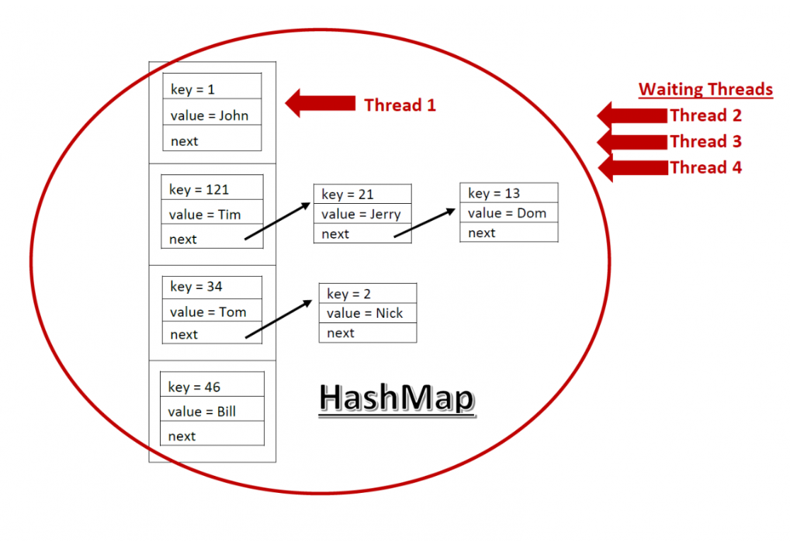
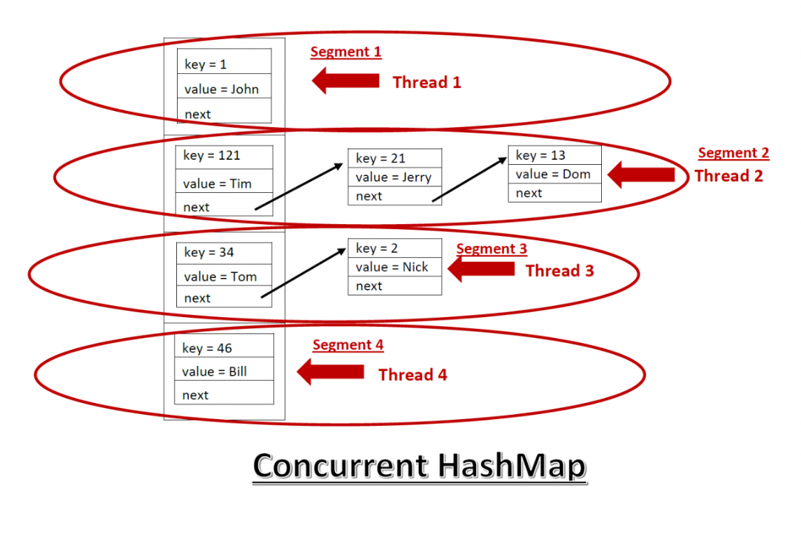

BlackJack CodeReview
==

1. If문을 쓰되 else를 없애자.

2. main함수는 최대한 간소화하자. (spring controller를 보면 최소한의 메서드만 쓴 걸 볼 수 있다...)

3. 객체의 책임을 분명히하자.

4. 클래스네이밍을 신경쓰자. 

메서드나 필드의 이름은 항상 신경써야한다. 직관적으로 읽혀야하며 해당 네이밍이 정확히 어떤일을 하는지 표현해야한다.

5. 캡슐화를 적용하자. Getter Setter를 이용해 접근하고 수정하자.

캡슐화를 왜 사용해야할까? 

private(protected)로 선언하게되면 다른 클래스의 접근을 허락하지않고 해당 클래스의 멤버를 외부에서 쉽게 바꿀 수가 없다.

이를 정보를 은닉한다고 말하며, 정보의 은닉으로 향후 유지보수나 확장시에 오류를 줄일 수 있다.

6. List타입과 ArrayList타입의 차이점
```java
 List<Card> cardDeck = new ArrayList<>();
 ArrayList<Card> cardDeck = new ArrayList<>();
```

답은 **다형성**이다. 
List는 인터페이스 ArrayList는 클래스다.

List<> = new ArrayList로 선언하게되면 나중에 ArrayList가 아닌 List인터페이스를 구현한 다른 클래스를 선언해줄 수 있기때문에 보다 **유연한**프로그래밍이 가능해진다.


7. git flow를 공부하자. (master, develop, feature)

    #Git폴더에 따로 정리

8. 라이브러리와 프레임워크의 차이점

익숙한 단어들이다. 내가 이제 막 학습을 시작한 Spring은 프레임워크이고, C언어를 공부하며 무심코 사용했던 <stdio.h>에 있는 printf, fopen, puts 등은 C에서 제공하는 기본 라이브러리다.

이들의 차이점은 프로그래밍 제어 흐름에 있다.

C 헤더파일에서 불러와 사용하던 함수들에대한 제어권은 나에게있다. 모든 흐름은 작성자가 설계하지만, Spring 프레임워크에서 제어 흐름은 프레임워크에있다.

그래서 이를 제어의 역전(IoC)이라 한다.

말 그대로 프로그래밍 제어의 책임이 개발자에게서 프레임워크로 넘어가게되고, 그만큼 개발자는 핵심 비지니스로직에 몰두할 수 있게된다.

IoC와 함께 나오는 개념중 DI(의존관계주입)이 있는데, 함께 이해하면 프레임워크에대한 이해가 쉬워질것 같다.

@Controller 나 @Service 애너테이션을 붙여주면 스프링이 올라올때 컴포넌트 스캔을 통해 스프링은 빈으로 객체를 등록하게되고, @Autowired를 이용해 생성자에 인스턴스를 스프링에게 주입받을 수 있다. 이를 DI라 한다.

보통은 객체를 개발자가 직접 생성하고 참조변수에 연결시켜주는 작업이 있어야지만 해당 인스턴스를 사용할 수 있지만, 애너테이션을 붙여줌으로 스프링에게 객체생명주기에대한 권한을 넘겨주게된다.

이처럼 제어의 역전은 제어의 흐름이 개발자에게서 외부환경으로 넘어가는것을 뜻한다.

---

1. Scanner vs BufferedReader

    보통 buffer는 StringBuffer 에서 들어보았지만 BufferedReader에대해선 처음 들어보았다. Scanner와 유사한 기능을 가진 BufferedReader에 대해 알아보자.

    C언어에서 scanf를 사용할 때 버퍼의 기능에대해 알아본적이 있다. 버퍼란 키보드의 입력을 버퍼라는 임시저장소에 모아놓았다가 버퍼가 가득차거나 개행문자를 만나면 프로그램에 한꺼번에 전달하는 방식이다.

    Java에서 Scanner는 1KB의 버퍼를 갖고 BufferedReader는 8KB의 버퍼를 갖는다. 당연하겠지만 8K를 한꺼번에 모아서 전송하는 방식과 1K를 모아서 전송하는 방식에는 **성능의 차이** 가 있을 수 밖에 없다. 

    추가적으로 Scanner는 내부에서 정규표현식적용, 파싱과정 등 여러 과정을 거치기때문에 성능이 더 느리다.

    자료에따르면 Scanner와 BufferedReader의 차이는 꽤나 크다.
    Scanner가 4.8초가 걸리는 일을 BufferedReader는 0.6초걸린다.

    Scanner와 달리 BufferedReader는 입력된 데이터형식이 String으로 고정이므로 데이터를 따로 가공해주어야한다. 추가로 예외처리가 필수적이다.

    PS할 때 scanner를 사용하면 문제를 제한시간 내에 못 푼다고한다. 현재 BlackJack 프로젝트에서는 정수하나를 입력받기때문에 큰 차이는 없겠지만 입력데이터가 늘어날 경우에는 BufferedReader를 고려하자.

2. 접근제어자

    접근제어자의 종류
        
        private protected default public

    1. 
        private은 범위가 가장 좁은 접근제어자로 해당 클래스내에서만 사용할 수 있고 클래스 밖에서는 사용 불가능하다. 메서드,클래스,필드에 붙을 수 있다.

        하지만 최상위 클래스에는 붙을 수 없고 내부클래스에 붙어서 외부에서 내부클래스에 접근할 수 없게 만든다.

    2. 
        protected는 동일한 패키지의 클래스 혹은 해당 클래스를 상속받은 다른 패키지의 클래스들이 접근가능하다.

    3. 
        default는 아무런 접근제어자를 명시하지 않았을때의 상태이고, 동일한 패키지내에서만 접근이 가능하다.

    4. 
        public은 가장 넓은 접근제어자로 어디서든 접근이 가능하다.
    
3. JVM과 메모리구조

    멘토님께서 static필드와 일반필드의 차이점을 고민해보라고 하셨다. 어느곳에 저장되는지를 알기위해 java의 메모리구조에대해 알아보는중에 메모리구조를 알기위해 **JVM(Java Virtual Merchine)** 에대해 먼저 알아보았다.

    자바의 정석 첫 페이지에 Java의 슬로건이 적혀있다.

        Write Once, Run Anywhere

    한 번 프로그래밍한 것은 어느 플랫폼에서도 실행된다.(멋있는 말이다.)

    Java는 OS에 종속적이지 않다. 더 정확히는 JVM이 있는 OS에서는 종속적이지않다.

    우리가 흔히 작성하는 .java파일은 JVM이 인식할 수 있는 .class파일로 컴파일된다.

    즉 JavaCompiler는 .java를 JavaByteCode로 .class파일로 변환해준다.

    .class파일은 JVM위에 올라가 OS가 인식할 수 있는 기계어로 다시 변환하여 OS(cpu)가 인식할 수 있게된다. (JIT Compiler)

    

    JVM의 내부 구조는 위 그림과 같다.

    **Class Loader** 는 .class 파일을 로드하고 링크하는 역할을 한다.
    런타임시에 새로운 클래스를 동적으로 로드하고 링크해준다.

    **Excution** 은 클래스를 실행시킨다. 다시 말해 .class파일을 클래스로더가 **Runtime Data Area**에 올려주면 위에 언급한 JIT컴파일러가 (JavaByteCode를)기계어로 번역해준다. 많이 들어보았던 GC도 보인다. GC는 사용하지않는 메모리를 수거해준다.

    자 이제 드디어 static과 non-static을 알아볼 수 있게됐다.

    

    앞서 설명한 클래스로더가 .class파일을 탐색하는중에 static키워드를 보는 순간 바로 MethodArea에 할당한다.
    MethodArea는 논리적으로 HeapArea이다.

    MethodsArea에는 클래스로더가 적재한 클래스의 모든 메타정보들이 올라간다. (이 때 static필드도 같이)

    다시말하자면 static필드는 클래스가 로드되는 시점에 같이 로드가되고 프로그램이 종료되기전까지 죽지않고 살아있다.

    그렇다보니... static을 남발하는것은 메모리관리에 좋지않다. MethodArea는 GC의 대상이 아니므로 메모리관리가 되지않는다.

    HeapArea는 모든 인스턴스가 동적으로 생성되고, GC의 관리대상이다. MethodsArea에 저장되어있는 클래스 메타데이터를 이용해 객체를 생성한다.

    결론적으로 non-static 필드는 객체가 생성되는 시점에 필드가 생성되기때문에 (HeapArea에서) static과 생성과 소멸의 기간차이(?)가 있다.

    엄밀히말하자면 static은 프로그램이 종료되기전까진 불멸의 존재이고, non-static은 작성자가 인스턴스를 사용하지않으면 GC에 의해 제거된다.

    추가로 StackArea는 메서드를 호출하고나서 할당되는 지역변수가 들어오는 곳이다. 메서드 호출이 끝나면 자연스레 사라진다.

---

1. JIT 컴파일러
    ---


    저번주 TIL에서 JVM에대해 알아보았다. .java파일이 자바바이트코드로 변환되어 .class파일을 만들고 .class파일은 **JIT컴파일러**에의해 기계어로 변환된다.

    JIT 컴파일러를 알아보기전에 정적 컴파일러와 동적 컴파일러에대해 알아보자.

    정적 컴파일러의 대표적인 예시는 C언어이다.

    C언어는 실행시점 이전에 컴파일을 모두 마치고 런타임에는 컴파일을 하지않는다. 실행이전에 모든 컴파일과정을 거치기때문에 컴파일시간이 늘어난다는 장점이 있지만, 런타임시에는 컴파일하는 과정이 없기때문에 런타임성능은 뛰어나다.

    파이썬은 동적 컴파일러(인터프리터)를 사용하는 대표적인 언어다. 실행이전에 컴파일하지않기때문에 컴파일시간은 매우 짧지만 실행 후 컴파일을 하기때문에 런타임성능은 떨어질 수 밖에 없다.

    JIT컴파일러는 정적 컴파일러와 동적 컴파일러의 특성을 모두 가지고 있다.

    JVM은 초기에 인터프리터방식만을 사용했다. 즉 런타임시에 바이트코드를 한줄한줄 읽어서 바이너리코드로 변환했다. 런타임성능이 떨어지자 등장한 컴파일러가 JIT컴파일러다.

    JIT컴파일러는 우선 모든 바이트코드를 컴파일한 후에 JVM이 인터프리터방식으로 코드를 변환하면서 중복되는 코드들을 체크하고 해당 코드들은 캐싱하여 JIT컴파일러에게 실행을 맡긴다. 

    이렇게 JVM은 인터프리터방식과 중복되는 코드들을 캐싱하여 실행하는 방식을 채택하여 기존의 인터프리터방식만을 가지는 컴파일러보다는 좋은 성능을 가진다.

---

2. Integer Cache
    ---

    멘토님께서 신선한 충격을 주셨다.

    ```java
    Integer l1 = 100;
    Integer l2 = 100;

    Integer l3 = 200;
    Integer l4 = 200;

    if(l1 == l2){
        System.out.println("l1==l2");
    }
    if(l1.equals(l2)){
        System.out.println("l1.equals(l2)");
    }

    if(l3==l4){
        System.out.println("l3==l4");
    }
    if(l3.equals(l4)){
        System.out.println("l3.equals(l4)");
    }
    ```
        결과:l1==l2
            l1.equals(l2)
            l3.equals(l4)

    equlas 메서드는 값이 같은지를 boolean타입으로 반환한다.

    당연히 l1과l2의 값은 같고 l3와l4의 값도 같으니 결과의 두번째 세번째 줄은 이해가 간다.

    그런데 왜 l1==l2는 true지만 l3==l4는 false일까?

    이유를 알기위해선 Integer클래스가 값을 어떻게 저장하는지 알아야한다.

    ```java 
        public static Integer valueOf(int i) {
        if (i >= IntegerCache.low && i <= IntegerCache.high)
            return IntegerCache.cache[i + (-IntegerCache.low)];
        return new Integer(i);
        }
    ```

    Integer l1 = 100; 으로 작성하면 위 valueOf메서드로 넘어가게된다.

    IntegerCache.low = -127 IntegerCache.hight = 128 로 정적멤버로 이루어져있다.

    즉 i의 값이 -127~128이면 캐시에 저장해놓고 재사용하게되고 그 이외의 값이 들어오면 객체를 새로생성해서 반환해준다.

    그래서 100을 할당한 l1,l2는 ==연산이 true지만 128을 넘는 200을 할당한 l3,l4는 false를 반환한다.

    이것을 Integer Cache라 부른다.

---

3. Object의 Equality 와 Identity
    ---
    Integer Cache를 알아보며 객체의 값이 동일한지 주소값이 동일한지 알아보았다.

    객체의 Equality는 Value(값)의 동일함을 뜻한다.

    객체의 Identity는 주소의 동일함을 뜻한다.

    ```java
        Integer a = new Integer(1);
        Integer b = new Integer(1);
    ```
    Equality에 따르면 a와 b는 같다. Value(1)가 같기때문이다.
    Identity에 따르면 두 객체는 다른 주소를 가지므로 같지 않다.

    >Integer Cache에 따르면 1은 Cache되야하는게 아닌가 의문을 가질 수 있겠지만, 위 코드는 new연산자를 사용해서 인스턴스를 새롭게 생성했기때문에 캐시되지않는다.

    ```java 
        Integer a = new Integer(1);
        Integer b = a;
    ```
    이 경우엔 어떨까? a와b의 값도같고 주소도 같다.

    정리하자면 Identity는 Equality를 보장하지만 Equality는 Identity를 보장하지 않는다.

4. Checked Exception & Unchecked Exception
    ---
    Exception클래스를 상속받는 클래스 중에서 Runtime Exception을 포함한 하위클래스를 Unchecked Exception이라고한다.

    Unchecked Exception 실행시 발생하는 예외로 예외처리를 강요하지않는다. 만약 예외가 발생할 수 있는 모든 경우에대해 예외처리를 강요하게되면 개발자들은 배열하나를 사용하는데도 예외처리를 해주어야된다...

    그에 반해 Checked Exception은 예외처리가 필수적이다. 컴파일 단계에서부터 예외처리를 강요해서 컴파일전부터 개발자는 예외처리를 해주어야한다.

    그리고 또 한가지 차이점은 Checked Exception은 롤백하지않고 Unchecked Exception은 롤백한다는 점이다.

    롤백이란 수행된 작업을 반영하지않는것을 말한다.

---

5. 강타입 & 약타입
    ---
    강타입과 약타입에 앞서서 정적타입과 동적타입에대해 알아보자

    정적타입은 컴파일시에 자료형이 결정되어야한다.
    ```java
        int a = 2;
        double b = 2.3;
    ```
    위와같이 자바코드는 컴파일 이전에 타입을 명시해줘야만한다. 이러한 언어를 정적타입언어라고한다. 정적타입의 언어에는 자주 사용했던 C언어가 있는데, C언어 또한 타입을 컴파일 이전에 명시해줘야한다.

    정적타입은 타입에대한 안정성을 보장한다. 또한 컴파일시에 타입을 결정하기때문에 런타임성능은 동적타입보다 높다. 하지만 동적타입에비해 유연성은 떨어진다. 

    동적타입언어는 런타임시에 자료형을 추론하기때문에 소스코드 작성시에 타입을 명시해줄 필요가 없다. 생각만해도 편할 것 같다. 하지만 유연함과 효율성을 얻은대신 타입에대한 리스크를 감수해야한다. 타입에대한 오류를 검증하기도 쉽지가 않다.

    강타입과 약타입이란 변수간에 형변환을 어느정도로 검사하느냐에 차이점이 있다.

    이름 그대로 강타입은 형변환에 굉장히 엄격하다. 약타입은 반대이다.

    자바는 자동 형변환을 지원한다.

    ```java
        byte a = 1;
        int b = a;
    ```
    위 자바코드는 오류가 발생하지않는다. 자동으로 형변환이되어 저장되기때문이다.

    배우지않은 언어지만 대표적인 강타입언어인 Go언어를 살펴보면,

    ```Go
        var num1 int = 17
        var num2 float32 = 19.2
        var sum1 float32 = num1 + num2	 // Error
    ```
    Go언어는 형변환에 매우 엄격하게 반응한다.

    그래서 멘토님께서 말씀하신 "문자열" + 1 = "문자열1" 이 되는 이유는 자바는 묵시적 형변환이 허락된 언어이기때문이다.

    **(참고. 정적타입과 동적타입은 강타입,약타입과는 다른 개념임을 인지하자.)**

---

ArrayList의 초기화 그리고 final
===
ArrayList의 용량
---
```java
List<INSTANCE> test = ArrayList<>();
```
일반적으로 객체를 담는 ArrayList를 기본생성자로 생성하면 크기가 0인 인스턴스가 생성된다.

그 후에 add()를 호출하면 디폴트값인 10만큼의 용량으로 늘어나게된다.

```java
// ArrayList 내부
private static final int DEFAULT_CAPACITY = 10;
```

이 후에 10개의 객체를 저장하고 다시 add()메소드를 호출하게되면 기존용량/2 만큼 증가해 15인 ArryList가 새로 생성 후 값을 복사해서 다시 인스턴스를 반환한다.

정리하자면 0 -> 10 -> 15 -> 22 -> 33 ~
으로 용량은 증가한다.

내가 저장해야할 용량을 정확히 알고있다면, 처음부터 용량을 지정해서 생성해주는 것이 좋다. 값을 복사해서 새로운 인스턴스를 반환하는데 비용이 들기때문이다.

List에 final키워드에 대하여
---
```java
final List<INSTANCE> test = ArrayList<>();
```
test라는 참조변수는 ArryList인스턴스의 주소를 가지고 있다.

final키워드는 재할당이 불가능하게하는 키워드다. 다시말해 test참조변수는 새로운 ArrayList를 반환받아 재할당이 불가능한 List가 된다.

---

ConstantPool
===
먼저 String은 불변클래스이다. 그 이유를 알아보자.

String이 불변클래스인 이유는 상수화되어 관리하려는 목적도 있지만, 보안적인 부분도 크다.

DB에 String으로 존재하는 중요한 데이터들이 변경가능할 여지가 있다면 보안적으로 위험한 상황에 놓이게된다.

또한 동기화적인 이유도 있는데 String이 변경가능하다면 비동기적인 처리에서 데이터를 안정적으로 관리하기 힘들 수 있다.

이제 StringConstantPool을 알아보자.

```java
String str = "hello";
```
위 문자열은 문자열 리터럴로 상수화되어 JVM 메모리영역중에 Heap메모리영역에 저장된다.(java 5이전엔 Static영역, 메모리부족현상 방지를 위해 이사)

Heap메모리에 들어간 StringConstantPool은 가변적으로 메모리를 조절할 수 있어서 더 많은 ConstantPool을 가질 수도 더 적은 ConstantPool을 가질 수도 있게된다.

기존의 Static영역은 메모리의 영역이 불변이기때문에 메모리가 넘칠 여지가 있었지만 이젠 그런 걱정이 사라졌다.왜냐하면 Heap영역은 GC가 작동하는 영역으로 사용하지않는 상수는 수거해가기때문이다.

또한 StringConstantPool은 내부적으로 HashTable구조를 가진다.

HashTable은 값을 hasing하여 key값으로저장하고, key값을 배열로 저장해 key값을 빠르게 찾을 수 있다. 그렇기때문에 성능이 보장된다.(배열은 List타입보다 자원을 검색하는 능력이 뛰어나다. 메모리공간이 인접해있기때문)

일반적으로 언급하는 ConstantPool은 Method Area에 있고 GC가 수거해가지못하는 영역이다.
Type, Field, Method의 정보들을 담고있다.

---

String / StringBuilder / StringBuffer
===
과연 위 세가지 클래스의 차이점이 무엇일까?

```java
String str = new String("a");
str = str + "b";
//결과 str = "ab";
```
그저 단순히 a에 b를 덧붙이고 다시 str에 저장하는 코드다. 단순하게 a와b를 붙이는 방식에는 큰 문제점이 없겠지만 극단적으로 문자를 10000번 연결한다고 가정해보자.

String은 불변클래스다. 한 번 만들어지면 수정이 불가능한 객체라는 뜻이다.

a에대한 String클래스가 만들어지고 b를 더하면 "ab"라는 문자열이 새롭게 생성되어 str에 다시 저장된다. 10000번 연결된다면 10000개의 인스턴스를 생성하고 10000번째 문자열을 str에 저장된다.

9999개의 인스턴스는 임시 가비지에 저장되어 GC의 수거를 기다린다. 연결하는 문자열이 많을 수록 메모리측면에서 부담이 가는 작업임이 분명하다.

그렇다면 StringBuilder와 StringBuffer는 어떨까?

StringBuilder와 StringBuffer는 가변성을 가지기때문에 .append()를 호출하면 새로운 객체를 반환하지않고 원래 인스턴스에 문자열을 추가해준다.

StringBuilder와 StringBuffer의 차이점은 StringBuilder는 thread-safe하지 않고 싱글스레드 환경에 적합하다. (싱글스레드에선 StringBuffer보다 성능이 뛰어나다.)

반대로 StringBuffer는 동기화 키워드를 제공해 thread-safe하고 멀티스레드환경에 적합하다.

thread-safe를 간단하게 알아보자.

멀티스레드 환경에선 다수의 스레드가 자원을 공유하며 작업하고 스레드의 작업우선순위는 OS스케쥴러가 제공하기때문에 무작위적으로 스레드는 작업하게된다.

스레드는 자원을 공유하기때문에 여러가지 문제점이 발생할 수 있는데 가령 A 스레드가 공유자원으로 작업을 하다가 작업을 끝마치지못하고 다음 우선순위인 B스레드로 우선순위가 넘어가면 B스레드도 공유된자원으로 작업할 때 문제가 발생할 수 있다.

이런 문제점들을 예방하기위해 동기화처리를 해주게되는데, 하나의 작업단위를 동기화처리를 해주게되면 하나의 스레드만 해당 작업을 진행할 수 있어 다른 스레드의 개입을 차단할 수 있다.

그런데 java 9 이후부터 문자열을 +로 연결해줄때 StringConcatFactory클래스를 만들어 makeConcatWithConstants메서드를 호출해 StringBuilder와 같이 객체를 새로 생성해 반환해주는것이 아니라 문자열을 그대로 더해주는 방식으로 변화되었다.

실제로 + 연산을 통한 문자열결합은 1000회 이하에선 StringBuilder와 비슷한 성능을 보인다. 하지만 1000회가 넘어가면 StringBuilder와 성능차이가 벌어지기 시작하니 자신이 어느정도로 문자열을 결합할지 잘 판단하고 사용해야한다.

(추가 String클래스에서 제공하는 Concat함수는 java5 이전에 + 형식으로 문자열을 결합하는 방식과 동일하다.)

---

WeakReference
===
자바가 참조를 하는 방식은 3가지가 존재한다.

1. Strong Reference (강한참조)

    ```java
    Integer a = new Integer(1);
    ```
    위 예시는 강한 참조의 예시로 GC의 수거대상이되지않는다.

    다만 a=null로 만들어주면 (명시적으로) 가비지컬렉터의 수거대상이 된다. 이 때 주의해야할 점은 a에 대한 모든 참조가 끊어져야한다. 다른 곳에서 참조를 하고 있다면 절대 수거대상이 되지 않는다.

2. Soft Reference (부드러운 참조)
 
    ```java
    SoftReference<Integer> soft = new SoftReference<Integer>(a);
    ```
    위 예시는 부드러운 참조의 예시다. 객체가 더 이상 필요가없어져서 a==null 상태가되면 GC는 수거대상으로 여기지만, 중요한 점은 **메모리가 부족하지않으면 수거하지않는다.**

3. Weak Reference
    ```java
    WeakReference<Integer> soft = new WeakReference<Integer>(a);
    ```
    약한 참조 또한 a == null 상태가되면 GC가 수거대상으로 여기고, 메모리가 부족한지 여부에 상관없이 GC의 수거대상이된다.

하지만 위 예시들은 너무나 단조롭다. 실제로 코딩을하다보면 객체들간의 관계가 위처럼 단조로울 수가 없다.

위 예시들은 모두 null로 해제를 하면 GC의 대상이 된다는 공통점이 있다. 아니 그렇다면 도대체 왜 약한참조와 부드러운참조를 사용하는걸까?

```java
Fruit apple;
Fruit orange;

Fruit strong;
WeakReference weak;

public void Test() {
    apple = new Fruit("apple");
    orange = new Fruit("orange");

    strong = apple;
    weak = new WeakReference(orange);

    Console.WriteLine(strong == null ? "null" : strong.name);//apple 출력
    Console.WriteLine(weak == null ? "null" : weak.name);//orange 출력

    apple = null;
    ornage = null;

    //GC 강제 수행
    System.GC.Collect(0, GCCollectionMode.Forced);
    System.GC.WaitForFullGCComplete();

    //강한참조는 strong이 참조하고 있으므로 객체가 해제되지 않았지만,
    //약한참조는 원본에 null 값을 넣으면 weak이 참조하고 있어도 객체가 해제된다.
    Console.WriteLine(strong == null ? "null" : strong.name);//apple 출력
    Console.WriteLine(weak == null ? "null" : weak.name);//null 출력
```
apple은 Fruit 인스턴스를 참조하고있고 orange도 Fruit 인스턴스를 참조하고있다. (당연한 말이지만 서로 다른 Fruit인스턴스를 참조중이다.)

**이 예시코드와 위 예시의 차이는 apple이 참조하는 Fruit을 다른 변수(strong) 역시 참조하고있다는 점이다.**

이때 apple을 null로 해제하면 메모리가(Fruit 인스턴스가)수거될까?

강한참조가 여전히 존재하므로(strong이 여전히 참조중) 수거되지않는다.

하지만 orange가 참조하는 Fruit 인스턴스는 WeakReference가 참조하고있다.

**여기서 orange가 null로 해제된다면 Fruit인스턴스를 WeakReference만이 참조하게된다. 이렇게 되면 JVM은 Fruit인스턴스를 수거대상으로 인식한다.**

여기서 핵심은 해당 인스턴스를 참조하는 변수가 WeakReference로 **유일**할 경우에 GC의 수거대상이된다.

물론 약한참조의 경우 메모리 부족여부에 상관없지만 부드러운참조는 메모리가 부족할때에만 수거를 진행한다.

```java
public static void main(String[] args) {
        WeakHashMap<Fruit, String> map = new WeakHashMap<>();
        Fruit apple = new Fruit("apple");
        Fruit orange = new Fruit("orange");
        map.put(apple, "test a");
        map.put(orange, "test b");
        apple = null;
        System.gc();
        map.entrySet().forEach(System.out::println );
    }
```

이 경우도 마찬가지다. WeakHashMap은 내부에서 WeakReference를 이용하는데 Key가 WeakReference 특징을 갖게된다.

apple이 가르키는 Fruit인스턴스를 Key또한 가르키고있다.

WeakHashMap이 아닌경우를 생각해보면 강한참조가 2번일어나고있다. 그러므로 apple을 null로 해제하더라도 강한참조가 남아있으므로 Fruit인스턴스는 그대로 남아있고 Key가 여전히 참조하고있다.

WeakHashMap의 경우엔 Key가 Fruit을 약하게 참조하고있음으로 apple을 null로 참조해제하게되면 Fruit을 참조하는 객체가 Key로 유일하기때문에 수거대상이된다. ( 핵심은 Fruit을 참조하는 객체가 약한참조객체로 유일할 때이다 )

이렇게 참조관계가 이중 이상인 경우에 약한참조와 부드러운참조 강한참조의 차이가 발생한다. 간단한 참조관계에선 이해하기가 어려울 수 있다.

자바에서 제공하는 참조유형은 한 가지 더 있다.

Phantom Reference인데 이 참조유형은 위에서 소개한 유형들과는 조금 독특한 형태를 가지고있다.

위 세가지 유형은 메모리가 수거되긴 할텐데, 다음 GC의 사이클이 언제 돌지 알 수가 없다. 약한참조로 연결되어 분명 GC의 제거대상임은 분명하지만 **언제** 수거될지 분명하지않다.

코드를 작성하다가 꼭 데이터가 지워지고난 뒤에 새로운코드를 작성해야하는 상황이 있다면, 즉 데이터의 제거가 확실해진 뒤에 작성해야하는 코드가 있다면 Phantom Reference를 사용하면된다.

```java
public class PhantomReference<T> extends Reference<T> {
  // ...

  public T get() {
    return null;
  }
}
public class PhantomReferenceExample {
  public static void main(String[] args) {
    ReferenceQueue<Object> referenceQueue = new ReferenceQueue<>();
    List<PhantomReference<Object>> phantomReferences = new ArrayList<>;
    List<Object> largeObjects = new ArrayList<>();

    for (int i = 0; i < 3; i++) {
      /* 1) Strong Reference로 생성 */
      Object largeObject = new Ojbect();

      /* 2) 생성한 largeObject를 largeObjects에 담기 */
      largeObjects.add(largeObject);

      /* 3) Phantom Reference로 생성 */
      phantomReferences.add(new PhantomReference<>(largeObject, referenceQueue));
    }

    /*
      4) largeObjects에 null 할당
      Strong Reference인 largeObject를 unreachable 상태로 만듬
    */
    largeObjects = null;

    /*
      5) GC를 실행합니다.
      `System.gc()`을 호출 하더라도 바로 GC가 동작한다고 보장할수는 없지만, 예제상 GC가 동작하였다고 가정함
    */
    System.gc();

    for (PhantomReference<Object> phantomReference: phantomReferences) {
      /* 6) phantomReference가 ReferenceQueue에 들어갔는지 확인함 */
      if (phantomReference.isEnqueued()) {
        System.out.println("enqueued");
      }
    }

    Reference<?> referenceFromQueue;
    while ((referenceFromQueue = referenceQueue.poll()) != null) {
      /* 7) phantomReference 제거 전 수행할 업무를 처리함 */
      ((LargeObjectFinalizer) referenceFromQueue).finalizeResources();

      /* 8) phantomReference 객체를 수동으로 clear() */
      referenceFromQueue.clear();
    }
  }

  public static class LargeObjectFinalizer {
    public LargeObjectFinalizer(Object referent, ReferenceQueue<? super Object> q) {
      super(referent, q);
    }

    public void finalizeResources() {
      System.out.println("clearing...");
    }
  }
}
```


Phantom Reference는 필수적으로 referenceQueue를 생성자에 넘겨주어야한다. ReferenceQueue는 메모리가 제거되는 대상을 큐에 넣어주게되고 이렇게 가시적으로 메모리의 제거가 확실해지면 다음 작업을 안전하게 진행할 수 있다.

사실 약한참조와 부드러운참조도 ReferenceQueue를 가질 수 있지만 필수적이진않다.

WeakHashMap
---
WeakHashMap은 위에서 설명한 약한 참조 특징을 갖는 HashMap이다.

보통 HashMap은 Key와Value를 put하고나서 사용여부는 전적으로 프로그래머에게 달려있다. 또 한 강한참조로 엮여있기때문에 사용하지않더라도 GC가 수거해가지않는다.

하지만 WeakHashMap의 경우엔 Key에 해당하는 객체를 null로 해제해주면 GC의 수거대상이되어 메모리가 해제된다.

(참고 : WeakHashMap에서 key == null로 객체를 해제하고 System.gc()를 call하는 예시들이 있지만,GC가 활성화되면 모든 프로세스가 중단되고 실행되기때문에 성능에 막대한 영향을 미침으로 사용을 자제하자! )

----

List size의 불변
---
List타입 참조변수를 final로 설정하면 참조변수에 다른 인스턴스를 할당하는 것은 불가능하다.

**하지만 List가 불변인것이 아니라 참조변수가 불변인 것이다.** List 자체는 add나 remove로 얼마든지 늘어나고 줄어들 수 있다.

이 때 add를 하거나 remove로 List의 사이즈를 변경하려하면 예외를 던지게하는 방법이 있다.

List.of("a","b")를 사용해 리스트를 초기화하게되면 그 이후엔 크기를 늘리거나 줄일 수 없다. 즉 진정한 불변객체가 되는 것이다.

Map과 Set도 동일하게 of()메서드를 사용하면 불변객체로 만들어줄 수 있다.

---

Synchronized 키워드
---

Synchronized 키워드는 메서드레벨에 붙는 키워드로 해당 메서드를 동기화처리를 해준다.

어떤 방식으로 동기화처리를 하는지 알아보자.

```java
public class Main {

    public static void main(String[] args) {
        A a = new A();
        Thread thread1 = new Thread(() -> {
            a.run("thread1");
        });

        Thread thread2 = new Thread(() -> {
            a.run("thread2");
        });

        thread1.start();
        thread2.start();
    }
}

public class A {

    public synchronized void run(String name) {
        System.out.println(name + " lock");
        try {
            Thread.sleep(1000);
        } catch (InterruptedException e) {
            e.printStackTrace();
        }
        System.out.println(name + " unlock");
    }
}
```
스레드는 2개를 생성했고 A라는 하나의 인스턴스만 생성했다.

a에는 synchronized 키워드가 붙어있음으로 해당 메서드는 하나의 스레드가 락을 걸면 다른 스레드는 접근이 불가능하다고 예측할 수 있다.

스레드가 메서드의 끝에 도달하면 lock을 반납할 것이고 thread2가 다시 락을 걸고 작업을 수행할 것이다.

```java
// 출력 결과
thread1 lock
thread1 unlock
thread2 lock
thread2 unlock
```

예상한대로 출력이 됐다. 그렇다면 A라는 인스턴스를 공유하는 상황이 아닌 두 개의 인스턴스를 각자 실행시킨다면 어떨까?

```java
public class Main {

    public static void main(String[] args) {
        A a1 = new A();
        A a2 = new A();
        Thread thread1 = new Thread(() -> {
            a1.run("thread1");
        });

        Thread thread2 = new Thread(() -> {
            a2.run("thread2");
        });

        thread1.start();
        thread2.start();
    }
}
```

a1 과 a2를 따로 나눠 run을 호출했다. 결과는 아래와 같다.

```java
// 출력 결과
thread2 lock
thread1 lock
thread1 unlock
thread2 unlock
```

thread2가 lock을 풀지도않았는데 thread1의 lock이 출력된 결과를 보면 **다른 인스턴스에대해선 lock을 공유하지 않다는걸 알 수 있다.**

그렇다면 synchronized 키워드는 인스턴스 접근자체를 막는걸까?

```java
public class Main {

    public static void main(String[] args) throws InterruptedException {
        A a = new A();
        Thread thread1 = new Thread(() -> {
            a.run("thread1");
        });

        Thread thread2 = new Thread(() -> {
            a.print("thread2");
        });

        thread1.start();
        Thread.sleep(500);
        thread2.start();
    }
}

public class A {

    public void print(String name){
        System.out.println(name + " hello");
    }

    public synchronized void run(String name) {
        System.out.println(name + " lock");
        try {
            Thread.sleep(1000);
        } catch (InterruptedException e) {
            e.printStackTrace();
        }
        System.out.println(name + " unlock");
    }
}
```

이번엔 상황이 조금 다르다. synchronized 키워드가 붙은 메서드와 붙지 않은 메서드가 있고, thread2에선 키워드가 붙지않은 메서드를 호출하고있다.

synchronized가 인스턴스 접근자체에 lock을 건다고 가정한다면 lock과 unlock이 호출된 이후에 hello가 호출되어야할 것이다.

출력결과를 확인해 보자.
 ```java
// 출력
thread1 lock
thread2 hello
thread1 unlock
 ```

 중간에 hello가 출력되었다.

 정리하자면 synchronized는 인스턴스에 락을 걸어준다. (락은 인스턴스당 하나 뿐) 하지만 synchronized가 붙은 메서드끼리만 락을 공유하지 붙지 않은 메서드에대해선 락을 공유하지않는다.

 즉 synchronized를 협업시에 사용할 땐 주의깊게 사용해야한다. 동기화 처리를 이용해 프로그램을 작성해야하는 상황이있을 때 10명중 1명이라도 synchronized키워드를 붙지지않는다면 동기화자체가 망가지기때문이다.

 이번에는 sychronized 키워드와 static 키워드가 붙는다면 어떤 방식으로 lock이 걸리는지 확인해보자.

 ```java
public class Main {

    public static void main(String[] args) throws InterruptedException {
        A a1 = new A();
        A a2 = new A();
        Thread thread1 = new Thread(() -> {
            a1.run("thread1");
        });

        Thread thread2 = new Thread(() -> {
            a2.run("thread2");
        });

        thread1.start();
        thread2.start();
    }
}
public class A {

    public static synchronized void run(String name) {
        System.out.println(name + " lock");
        try {
            Thread.sleep(1000);
        } catch (InterruptedException e) {
            e.printStackTrace();
        }
        System.out.println(name + " unlock");
    }
}
 ```
 static은 기본적으로 인스턴스의 생성과는 상관이없다.

 출력결과부터 확인해보자.

 ```java
// 출력 결과
thread1 lock
thread1 unlock
thread2 lock
thread2 unlock
 ```

 서로 다른 인스턴스를 생성했음에도 thread1의 lock이 풀린뒤에 thread2의 lock이 걸린 것을 볼 수 있다.

 즉 static 과 synchronized 키워드가 함께 붙으면 클래스레벨에서 lock을 걸게된다.

---
HashMap/HashTable/ConcurrentHashMap & 해시충돌과 해결방안
---

우선 각각의 특징을 자세히 알아보기전에 먼저 내가 알고 있는 점들을 정리해보자.

우선 HashMap 과 HashTable의 가장 큰 차이점은 Thread-safe 하느냐 그렇지 않느냐로 구분 할 수 있다.

```java
    //HashTable 내부
    public synchronized int size() {
        return count;
    }
    public synchronized boolean isEmpty() {
        return count == 0;
    }
    public synchronized Enumeration<K> keys() {
        return this.<K>getEnumeration(KEYS);
    }
    public synchronized Enumeration<V> elements() {
        return this.<V>getEnumeration(VALUES);
    }
```

HashTalbe의 일부 메서드인데 모두 synchronized 키워드가 붙어있다. 

하지만 HashTable과 동일한 메서드를 HashMap에서 살펴보면 synchronized 키워드가 붙지 않는 것을 볼 수 있다.

정리하자면 HashTable은 스레드에 안전 고로 멀티스레드환경에 적합하다. HashMap은 스레드에 안전하지 않고 싱글스레드환경에 적합하다.

그렇다면 HashTable보다는 성능면에서 뛰어나고 멀티스레드환경에 적합한 클래스는 없을까?

ConcurrentHashMap이 바로 성능도 HashTable보다 뛰어나고 멀티스레드환경에서 사용하는 클래스이다.

세 클래스들을 알아보기 이전에 HashMap의 구조에대해 알아보자.

**HashMap은 기본적으로 배열을 사용한다.**

Key - Value로 이루어져 있으며 Key값을 해싱함수로 인덱스를 구한 뒤에 해당 인덱스에 Value를 집어 넣는 구조다.

이 때 두 가지 조건이 있다.

```java
//HashMap 내부
static final int hash(Object key) {
        int h;
        return (key == null) ? 0 : (h = key.hashCode()) ^ (h >>> 16); // 비트연산
    }
```
키값을 해싱한 후 리턴받는 값은 **정수** 여야만 한다.

또 한가지 조건은 인덱스는 배열의 크기를 넘어서는 안된다. (당연)

그렇다면 key와 value는 어느곳에 저장이되는 것일까?
```java
transient Node<K,V>[] table;
```
Node 라는 객체배열을 table이라는 참조변수로 선언하여 사용하는것을 볼 수 있다.

    즉, key와 value를 가지는 객체(node)들의 배열(table)을 사용한다.

Node클래스의 내부를 자세히봐보자.

```java
static class Node<K,V> implements Map.Entry<K,V> {
        final int hash;
        final K key;
        V value;
        Node<K,V> next;
}
```

key와 value 이외에도 hash값 next라는 필드가 더 있는 것을 볼 수 있는데 **next라는 필드가 해시충돌을 해결하는 하나의 방법이 된다.**

자 이제 HashMap이 내부적으로 어떻게 저장되는지 알았으니 해시충돌에 대해 알아보자.

해시값은 키값을 해싱한 결과로 굉장히 많은 결과값을 갖지만 아쉽게도 인덱스는 한정돼있다.

그렇다는 말은 서로 다른 키더라도 해싱한 결과 즉 해시값 또 다른 말로 인덱스가 겹칠 수 있다는 말이다.

배열에서 인덱스가 겹친다니 ... 말만 들어도 큰 일이 날 것 같다.

이런 해시충돌을 해결하기 절차가 있다.

1. 첫 번째 : 테이블의 75% 이상 채워지면 충돌 확률이 급격히 높아진다. 확률적으로 이미 점유하고있는 인덱스가 많을 수록 새로 들어오는 key의 해싱값이 동일한 인덱스로 지정될 확률이 자연스레 높아진다. **그래서 단순하게 배열의 크기를 증가시켜준다.**

```java
//HashMap resize 메서드 내부
else if ((newCap = oldCap << 1) < MAXIMUM_CAPACITY &&
                     oldCap >= DEFAULT_INITIAL_CAPACITY)
                newThr = oldThr << 1; // double threshold
```

75% 임계점을 넘으면 HashMap은 2배의 크기의 Table을 생성하는데 이 때 쉬프트연산자로 2배 증가시켜준다. (2진수에서 1을 한자리씩 왼쪽으로 밀어준다.)

2. 두 번째 : 테이블의 크기를 늘려줘도 해시값이 충돌할 확률은 여전히 존재한다. 이미 충돌했다면 그에대한 대안이 있어야한다.

그 대안은 아까 위에서 설명한 Node클래스의 필드 중에서 next라는 필드가 해결한다.

만약 해시값이 같아 같은 인덱스를 배정받았다면 이미 점유하고 있는 Node인스턴스의 next필드에 다음 지정될 Node의 주소를 넘겨준다.

링크드리스트의 구조라고 생각하면 된다.

3. 세 번째 : 링크드리스트는 탐색에 걸리는 시간이 굉장히 길다. 추가와 삭제에는 빠르지만 n개의 데이터가 있다면 시간 복잡도는 O(n)이 되므로 일정 충돌 수가 넘어가면 **데이터를 다른 방식**으로 저장한다.

```java
//HashMap 내부
static final int MIN_TREEIFY_CAPACITY = 64;
```

실제로 64가 넘게되면 데이터 구조를 변경한다.

```java
final void treeifyBin(Node<K,V>[] tab, int hash) {
        int n, index; Node<K,V> e;
        if (tab == null || (n = tab.length) < MIN_TREEIFY_CAPACITY)
            resize();
        else if ((e = tab[index = (n - 1) & hash]) != null) {
            TreeNode<K,V> hd = null, tl = null;
            do {
                TreeNode<K,V> p = replacementTreeNode(e, null);
                if (tl == null)
                    hd = p;
                else {
                    p.prev = tl;
                    tl.next = p;
                }
                tl = p;
            } while ((e = e.next) != null);
            if ((tab[index] = hd) != null)
                hd.treeify(tab);
        }
    }
```

위 코드에서 replacementTreeNode 메서드가 Node객체를 TreeNode로 바꿔주게된다.

TreeNode는 Node객체를 상속한 클래스로 간단하게 생각하면 Node객체에서 몇 가지 기능을 추가한 클래스이다. (Tree 구조의 클래스)

do while 문을 돌며 충돌한 인덱스의 모든 Node들을 순회하며 TreeNode로 바꿔준다.

```java
TreeNode<K,V> replacementTreeNode(Node<K,V> p, Node<K,V> next) {
        return new TreeNode<>(p.hash, p.key, p.value, next);
    }
```

위 코드처럼 기존 Node객체의 해쉬값 키값 value next 4가지 필드를 모두 생성자에 넘겨준다.

후에 treeify 메서드를 이용해 트리화를 마치게되는데 트리화가 완료되면 시간복잡도는 O(log n)이 되게된다.

위 세가지 절차를 Chaining 방식이라고 부른다.

이 외에도 Linear probing, Quadratic probing, Double hasing 이 존재한다.
---

Linear probing은 충돌이 발생하면 빈 slot을 선형으로 찾아서 그 곳에 값을 저장한다. 선형으로 탐색한다는 말은 충돌이 발생한 인덱스로부터 +1씩 이동해 값의 유무를 판단한다.

하지만 선형탐색으로 값을 추가하게되면 군집화가 발생한다. 충돌이 발생한 주변 인덱스에 데이터를 계속해서 넣기때문에 한 구간은 지속적으로 데이터가 저장되어 탐색시간을 증가시키는데 최악의 경우엔 전체를 탐색하게될 수 있다.

Linear probing이 선형으로 탐색했다면 Quadratic은 이차식을 이용해 탐색한 후 그 곳에 값을 넣는다. Linear probing보다는 군집화의 정도가 낮을 수 있지만 비어있는 공간을 못찾을 확률이 존재한다. 선형으로 모든 공간을 확인하지않기때문이다.

Double hasing은 기존 해시함수 외에 보조적인 해시함수를 추가해서 두 값을 합한 뒤에 해시값을 도출해내는데 충돌과 군집화를 막아내기엔 좋지만 해시함수를 두 가지 사용한다는 점에서 성능에 악영향을 줄 가능성이 매우 높다.

hashmap의 구조와 해시충돌의 해결법까지 알아보았다. 이제 ConcurrentHashMap은 hashmap과 어떻게 다른지 알아보자.
--

hashmap은 스레드에 안전하지않고 hashtable은 스레드에 안전하다. 하지만 hashtable은 map전체에 락을 걸기때문에 성능이 떨어질 수 밖에없고 hashmap은 아예 동기화를 지원하지않는다.

hashtable보다 성능이 좋고 스레드에 안전한 자료구조가 바로 concurrenthashmap이다.

  

  HashMap을 synchronized해주기위해선 버킷 전체에 락을 걸고 다른 스레드는 버킷전체에 접근이 불가능하다.

  하지만 concurrenthashmap을 보자.



concurrent hashmap은 버킷전체에 락을 걸지않고 버킷하나하나에 락을 걸기때문에 여러 스레드가 접근할 수 있다.

concurrent hashmap이 성능이 좋은 이유가 여기에 있는데 맵 전체에 락을 걸었다면 스레드간에 경합이 발생하므로 성능저하가 일어나지만, concurrent hashmap은 버킷단위로 락을 걸기때문에 경합이 줄어든다.

심지어 concurrenthashmap은 읽기작업엔 락을 걸지않고 쓰기 작업에만 락을 건다.

더 자세히 알아보자면 쓰기작업에도 모두 락을 거는 것은 아니다.

엔트리를 삽입할 때 비어있는 버킷인지 값이 있는 버킷인지를 판단하게되는데 비어있는 버킷에는 락을 걸지않고 CAS연산을 이용해 작업하고 값이 있는 버킷에만 락을 걸고 다른 스레드의 접근을 막는다.

CAS연산이란 Compare And Swap의 약자로 비교 후에 값을 교환한다는 의미이다.

```java
public class Counter {
    private volatile int count;

    public void increment() {
        int oldValue;
        int newValue;
        do {
            oldValue = count;
            newValue = oldValue + 1;
        } while (!compareAndSwap(oldValue, newValue));
    }

    private synchronized boolean compareAndSwap(int oldValue, int newValue) {
        if (count == oldValue) {
            count = newValue;
            return true;
        }
        return false;
    }
}
```

volatile 변수에대해 알아야하는데 volatile은  메인메모리에 직접 올라간다. 

스레드자체가 cpu캐시 메모리를 가지기때문에 일반 변수가 변화되었을 때 다른 스레드가 변수의 변화를 알아차리기 어렵지만 volatile은 메인메모리에 직접올라가기때문에 모든 스레드가 해당 값의 변경사항을 알아차릴 수 있다.

volatile을 캐싱한 값과 메인메모리에올라온 값이 다르면 스레드는 다시 volatile변수의 값을 읽어오도록되어있기때문에 항상 최신의 값을 유지할 수 있는 것이다.

해당 비교는 JVM이 담당하도록 설계되어있다.

이렇게 synchronized를 사용하지 않고 먼저 체크한 후에 행동을 취하는 방식을 CAS라고 한다.

이렇게 빈 버킷에 값을 저장할 때는 null이라는 기대값과 비교를해서 비어있는 경우엔 동기화하지않고 값을 저장하고 이미 값이 있는 경우엔 동기화처리를 한 뒤에(세그먼트 단위로) 값을 저장한다.

또 한가지 중요한 점은 concurrenthashmapd은 세그먼트 단위로 락을 건다는 점인데 위에서 설명할땐 단순히 버킷단위로 락을 건다고 했지만 사실 여러 버킷을 하나로 묶은 단위인 세그먼트 단위로 락을 걸게된다.

세그먼트 단위는 내부적으로 기본 16개로 설정이 되어있다. 만약 1024개의 엔트리가 있다면 세그먼트는 64개가 되는것이다.

```java
ConcurrentHashMap<String, Integer> map = new ConcurrentHashMap<>(16, 0.75f, 4);
```

위 코드는 ConcurrentHashMap의 생성자인데 3번째 파라미터가 concurrencylevel로 세그먼트의 갯수를 지정할 수 있다.

두 번째 파라미터는 load factor로 맵의 크기가 얼마나 가득차면 리사이징을 할지 결정하는 파라미터다. 위에선 75프로가 기준이 된다.

내가 사용할 데이터의 크기를 가늠하고 적절한 load factor와 세그먼트레벨을 잘 결정해줘야한다.


