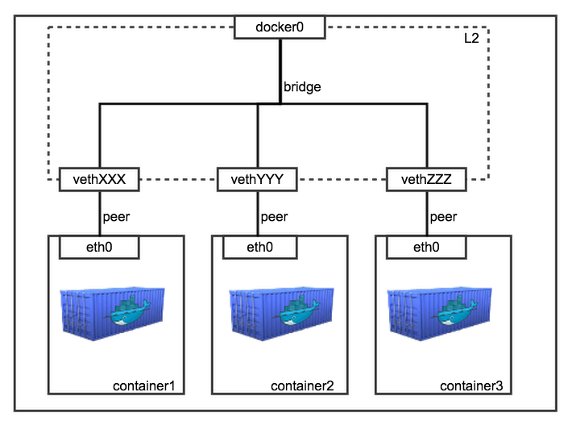

## Docker NetWork

도커를 호스트 OS에 설치하면 위와같은 구조로 실행된다.

도커가 실행되면 가상 이더넷 인터페이스가 호스트 OS상에 등록된다.

이 docker0는 DHCP를 통해 할당받은 것은 아니고 도커 내부 로직에의해 할당된다.

> DHCP : 자동으로 IP를 할당 (공유기를 생각하면 됨)

docker0는 컨테이너가 통신하기위한 가상의 네트워크다.

즉 컨테이너는 통신하기위해선 꼭 docker0 인터페이스를 거쳐야만한다.

위 사진처럼 컨테이너가 하나씩 생성될 때 마다 docker0의 브리지에 컨테이너의 인터페이스가 하나씩 binding된다.

브리지쪽에 vethXXXX 컨테이너쪽에 eth0이 하나씩 할당돼 서로 패킷을 주고받는다.

> 결과적으로 컨테이너끼리 완벽하게 격리된 네트워크 구조를 갖는다

### 컨테이너 게이트웨이

위 내용은 도커 컨테이너중 하나를 docker inspect 명령어로 확인한 것인데 Gateway는 172.22.0.1로 설정된 것을 볼 수 있다.

다른 도커 컨테이너도 동일하게 172.22.0.1로 할당돼 있는데 

이는 docker0의 IP와 동일하다.

즉 컨테이너는 모두 docker0를 통해서 외부와 통신을 하게된다.

### 네트워크 종류

위에선 bridge네트워크를 사용해 docker0와 1:N으로 컨테이너가 연결되지만 다른 네트워크 방식을 사용할 수 있다.

Host : 호스트 OS와 네트워크를 공유한다. docker0에 바인딩 되지않음

Container : 다른 컨테이너의 네트워크를 공유한다.