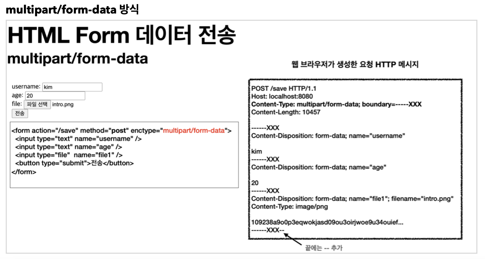

## HTTP Multipart/form-data

S3에 이미지를 업로드하는 api를 구현하면서 처음 HTTP header multipart/form-data를 사용해봤다.

보통 자주 쓰는 방식은 Content-type을 aplication/json 형식으로 주고받는다.

그런데 이미지와 텍스트를 동시에 보내야할 땐 multipart/form-data를 사용해야한다.

즉 여러 Content-Type을 한꺼번에 보낼 수 있게 해준다.

위 요청 메세지를 보면 Content-Type은 multipart/form-data로 돼있고 boundary라는 단어가 보인다.

boundary는 여러 데이터들을 구분해주는 구분자다.

boundary는 유니크해야한다는 특성을 갖고 이 구분자를 이용해 데이터를 파싱한다.

각각의 boundary에는 각자의 content-type도 존재한다.

나의 경우 게시글의 정보는 application/json content-type으로 전송했다.
