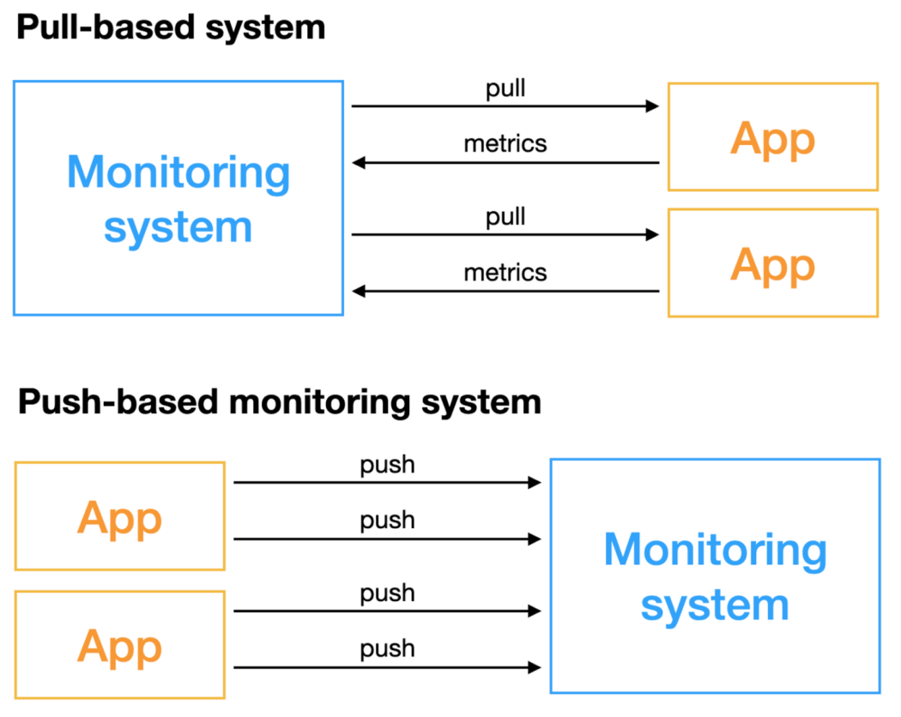
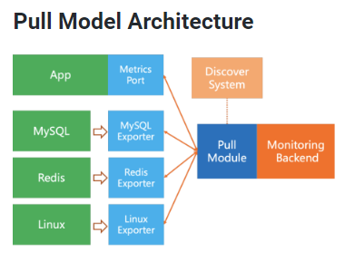

## Log vs Metric

APM에대해 공부하면서 Log와 Metric의 차이점이 눈에 보였다.

보통 스프링 톰캣 서버를 키고 어떤 오류가 있는지 확인하기 위해서는 로그를 확인한다.

또한 개발자가 특정 이벤트를 감지하거나 수집하기위해서도 로그를 기록한다.

즉 로그는 어떤 오류가 발생했는지 자세히 들여다 볼 수 있다.

하지만 Metric은 이벤트에대해 자세한 맥락은 제공하지 않고 시간에따른 집계를 제공한다.

예를 들어 HTTP 요청 건수, 레이턴시, 진행중인 요청 건수 등을 알아볼 수 있다.

쉽게 말해 몇 건의 요청이 지난 1분간 이루어졌고 레이턴시는 몇 번이며 DB호출은 몇 번이 일어났는 지에 관심을 둔다.

각 코드의 비용, 코드의 경로 등은 로깅의 관심사다.

## Pull VS Push

Metric을 수집하는 방식은 2가지 정도로 구분한다.

Pull 방식은 **능동적으로 메트릭을 수집한다.**

Push 방식은 **오브젝트가 수집서버에게 메트릭을 전송한다.**

Push 방식의 경우 당연히 Agent가 수집서버의 end-point ip를 알아야한다. (알아야 보내니)

Pull 방식은 반대로 수집서버가 원격으로 Agent를 알고 있어야한다.

agent는 수집서버의 정보를 알지 못하고 내부 Metric을 노출하면 수집서버가 능동적으로 접근해 수집한다.

위 사진에서 보이듯 여러 컴포넌트들은 Pull Protocal을 지원하지 않기 때문에 따로 Exporter를 이용해 Metric을 풀링해야한다.

### 그래서 Pull ? Push ?

Pull 방식은 Agent 서버의 부하를 덜어준다.

Push 방식의 경우 모니터링이 목적인데 Metric을 수집하고 전송하는 일이 다른 애플리케이션 성능에 영향을 미칠 수 있다.

하지만 Pull 방식은 모니터링 시스템이 직접 접근하기 때문에 위와 같은 문제는 적다.

하지만 Pull 방식이 장점만 있지는 않다.

프로메테우스는 Pull 방식인데 데이터를 단일 노드에서 처리하기때문에 샤딩과 같은 데이터를 분산하는 방식을 사용해야한다. (확장이 필요한 경우)

반면 Push 방식은 기본적으로 분산된다.(Agent가 Push하기 때문에 단일 노드로 집중하지 않아도 된다.)

모니터링 시스템을 분산처리하는 일은 더 공부해봐야 알 것 같다.
## Scouter

LG CNS에서 만든 APM 시스템이다.

적용하면서 정말 정말 힘들었다.(간단하단 사람이 누구였나)

우선 가장 애를 먹었던 점은 다름아닌 Docker-Compose 파일이였다.

Was 서버 2대에 모두 스카우터를 이용해 모니터링을 해야했는데 EC2에서 직접 스카우터옵션과 함께 jar를 실행하면 성공하는데

이상하게도 이미지를 빌드하고 pull 한 뒤 docker compose run을 하면 스카우터 jar파일을 인식하지 못했다.

dockerfile에서 직접 스카우터 conf 파일과 jar파일을 카피해서 이미지를 빌드하니 성공했다.

> 왜 안됐는지는 아직도 알 수가 없다...

### 적용기

스카우터는 기본적으로 Agent(지금 내 상황에선 Tomcat)가 메트릭을 수집하고 Collector(GCP Computing Engine)로 쏴준다.

메트릭 수집 주기, Collector 서버 주소, 포트 등 여러 설정은 위에서 언급한 conf파일에 작성한다.

그리고 로컬에서 Scouter Client를 실행하면 메트릭 정보를 수집해서 시각화 시켜준다.

사실 모니터링 아키텍처는 그리 복잡하진 않다.

이제 mysql, redis를 모니터링 해봐야겠다.

