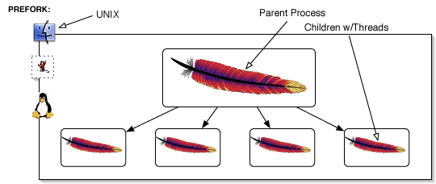
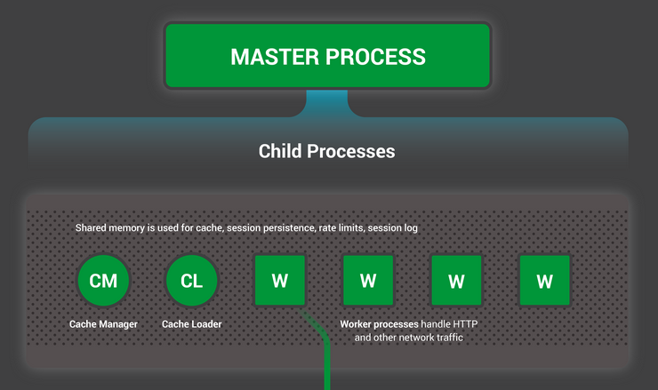
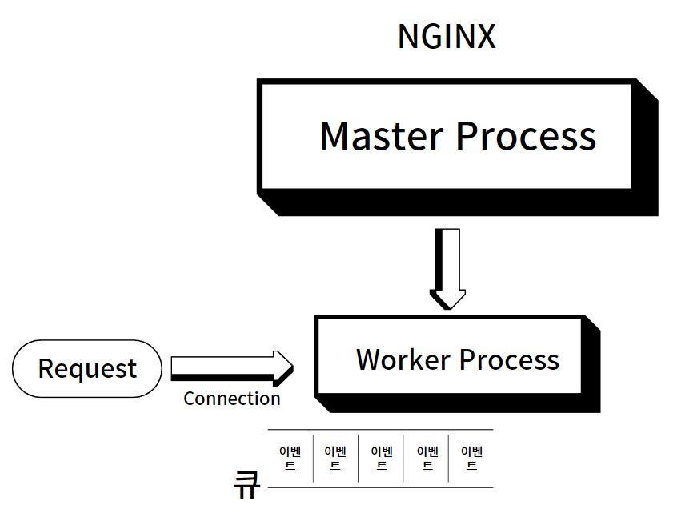

## Nginx

Nginx에대해 검색하면 나오는 키워드는 싱글스레드 비동기 이벤트 드리븐 처리방식으로 Apache보다 가볍고 훨씬 높은 동시처리능력을 가진다고 한다.

하나하나 알아보자.

## Apache보다 나은 Nginx?

Apache는 Nginx가 출시되기 전 가장 유명했던 웹서버다.

기본적으로 하나의 요청에 하나의 프로세스(혹은 스레드)를 할당한다.

하지만 프로세스(스레드)를 생성하는 시간이 길기 때문에 PREFORK 방식으로 프로세스를 미리 생성해놓고 요청이 들어올때마다 하나씩 할당해주는 방식을 택하고있다.

1990년대에는 스마트폰과 PC의 보급이 지금처럼 원활하지는 않았기때문에 동시연결을 감당할 수 있었다.

## C10K Problem

Connection 10000 Problem

1999년 이후로 인터넷 사용자는 폭발적으로 증가했다.

이로인해 아파치는 동시접속 커넥션을 1만개이상 생성할 수 없는 문제에 부딛힌다.(현재는 개선됐다.)

프로세스와 스레드를 요청마다 무작정 생성하는 일은 **HW 리소스**를 많이 소모한다. 또한 CPU코어 수 이상으로 프로세스를 생성하기때문에 **Context Switching**이 빈번하게 발생해 성능이 저하됐다.

## Nginx는 달라요

2004년 출시된 Nginx는 원래 Apache서버의 앞단에서 요청을 보조하는 역할로 출시됐다.

### 무엇때문에 Nginx는 그 시절 Apache보다 빨랐을까?

바로 **싱글스레드, 비동기처리, 이벤트 드리븐**구조를 가지기때문이다.

그럼 도대체 싱글스레드 비동기 이벤트 드리븐 구조는 무엇인가??

## Nginx의 구조

Nginx는 Master Process를 기반으로 Child Process인 Worker Process를 가진다.

Master Process는 /etc/nginx/.conf 파일을 기반으로 Worker Process를 생성하는 책임을 가지고있다.

실질적으로 요청을 처리하는 일은 **Worker Process**가 한다.

이 Worker Process는 최대 CPU 코어 수 만큼 생성된다.

### 왜 CPU 코어 수 만큼??

앞서 살펴본 아파치는 프로세스의 개수가 코어 수를 넘어선다.

그렇기에 컨텍스트 스위칭이 빈번하고 많은 동시접속을 처리할 때 성능 저하로 이어진다.

하지만 코어 수 만큼 처리한다면 컨텍스트 스위칭은 적게 발생한다.

### Worker Process

Worker Process에는 이벤트 루프가 존재한다.

이벤트 루프에 앞서 Nginx에서 말하는 이벤트에대해 알아야한다.

Nginx에게 있어서 이벤트라는 것은 클라이언트의 요청에 따른 커넥션 생성, 제거, Data Request 등을 말한다.

이 요청은 OS 커널이 Worker Process의 이벤트 큐에 하나씩 추가한다.

### 이벤트 루프

Nginx의 Worker Process는 각 프로세스마다 하나의 이벤트 루프를 가진다.

이 이벤트 루프는 스레드 하나가 담당한다.

> 그래서 Nginx를 싱글스레드 기반이라고 말하는 것이다.

이 싱글스레드는 계속해서 루프를 돌아 이벤트 큐에 작업이 있는지를 검사하고 이벤트를 꺼내서 하나씩 처리한다.

### 큐에 오래걸리는 작업이 있으면?

이벤트 중에서 Disk I/O같은 무거운 작업이 있다면 뒤쪽 이벤트들은 Block된다.

그래서 Nginx는 스레드 풀을 만들어 오래걸리는 작업은 다른 스레드에게 작업을 위임하고 뒤쪽 이벤트들을 처리한다.

### 그래서 왜 빠른건데

TCP/IP HandShake를 생각해보자.

위 과정은 네트워크 커넥션을 연결하는데 빈번하게 발생한다면 성능이 저하되기쉽다.

그래서 HTTP 메세지 헤더에 Keep-Alive가 있는 것이다.

TCP 연결을 지정된 시간동안 유지하라는 헤더다.

즉 아파치에선 하나의 커넥션에 하나의 프로세스가 할당되고 사용자가 아무런 요청을 하지않더라도 계속해서 프로세스는 리소스를 점유하게된다.

하지만 Nginx는 하나의 Worker Process가 여러개의 커넥션을 형성한다.

커넥션에서 어떠한 요청이 없더라도 그 커넥션만 듣고있지않고 다른 커넥션의 이벤트를 처리할 수 있는 것이다.

> Non-Blocking 처리방식

## Nginx 공식 블로그

https://www.nginx.com/blog/inside-nginx-how-we-designed-for-performance-scale/

위 블로그에서 Nginx가 어떻게 작동하는 지를 설명하는데 아주 좋은 설명이 있다.

## NGINX is a True Grandmaster

Nginx는 하나의 Worker Process를 한 명의 체스 그랜드 마스터로 비유하고 이 마스터와 게임을 하는 수많은 아마추어들을 클라이언트의 요청으로 비유한다.

아주 적합한 설명인 것 같다.

그랜드마스터는 한 명의 아마추어와 게임하는 것이아니다.

여러 아마추어들과 돌아가며 말을 움직일 때마다 마스터가 움직여 요청을 받아준다.

커넥션으로 대입해봐도 이해가 쉬워진다.
